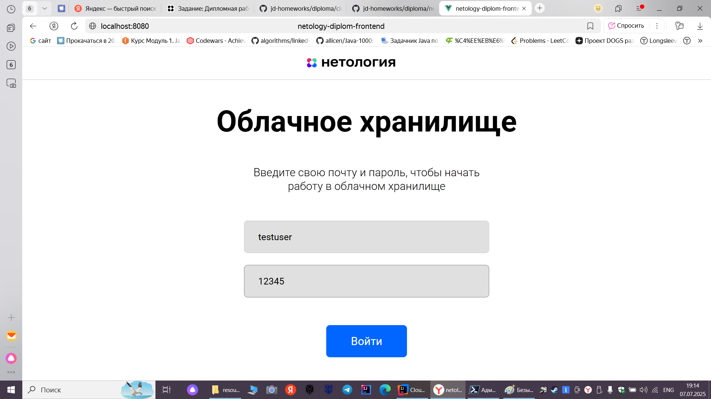
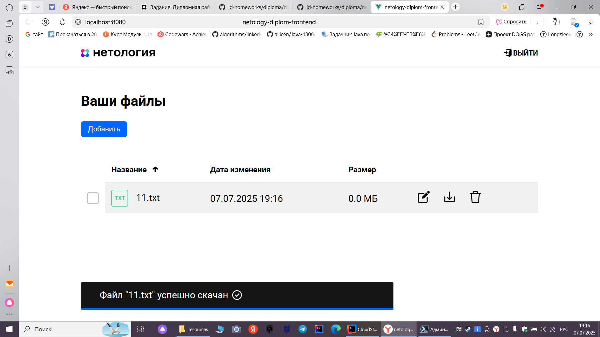
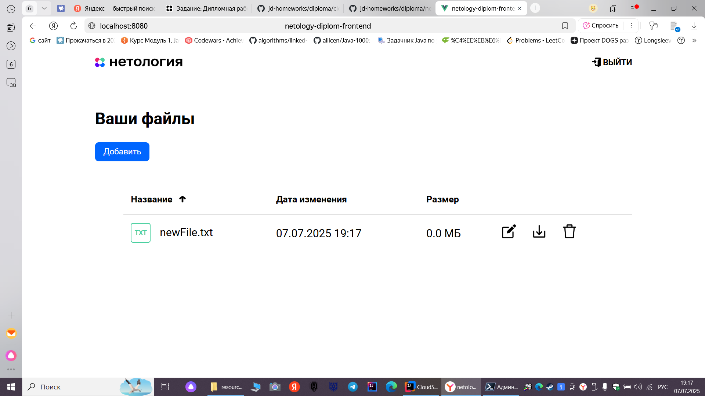
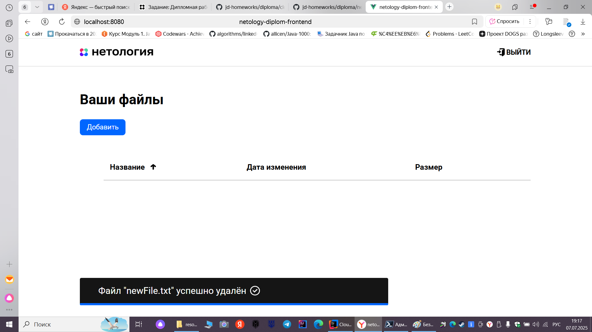

# Дипломный проект: Облачное хранилище

## Описание проекта
Данный проект представляет собой REST-сервис, разработанный в рамках дипломной работы. Сервис предоставляет функционал для загрузки файлов, вывода списка загруженных файлов пользователя и управления ими через авторизованный доступ. Веб-приложение (FRONT), предоставленное заранее, интегрировано с сервисом без доработок, используя его API для авторизации, загрузки и отображения файлов.

## Требования к приложению
- Сервис должен реализовать REST-интерфейс для интеграции с фронтендом.
- Обязательная реализация методов, описанных в спецификации (YAML-файл):
    1. Вывод списка файлов пользователя.
    2. Добавление файла.
    3. Удаление файла.
    4. Авторизация пользователя.
- Настройки приложения должны загружаться из файла конфигурации (например, `application.yml`).
- Данные пользователей и файлы должны храниться в реляционной базе данных (использована PostgreSQL).

## Требования к реализации
- Разработка выполнена с использованием **Spring Boot**.
- Сборка проекта осуществляется с помощью **Maven**.
- Приложение запускается через **Docker** и **Docker Compose**.
- Код размещен в репозитории на **GitHub**: [https://github.com/Nikitastolyarow](https://github.com/Nikitastolyarow).
- Код покрыт **unit-тестами** с использованием **Mockito** и **интеграционными тестами** с **Testcontainers**.
- Документация и спецификация доступны в репозитории.

## Реализованный функционал

### Вход в личный кабинет

### Личный кабинет

### Загрузка файла

### Успешная загрузка файла

### Скачивание файла

### Переименование файла

### Удаление файла

